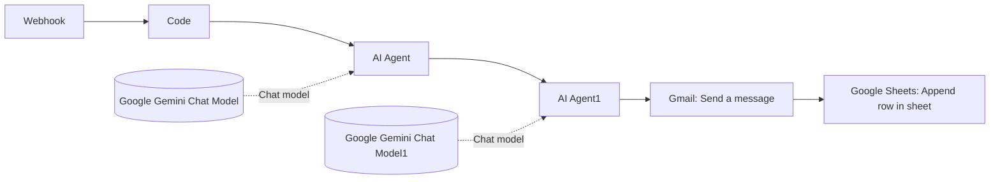

# Telemedicine AI

◆ Multilingual telemedicine automation built with n8n and Google Gemini.

Telemedicine AI streamlines patient intake, language-aware symptom handling, AI-generated guidance, email delivery, and Google Sheets logging. The repository includes the n8n workflow export and a companion JavaScript helper for the workflow's Code node.

## ◆ Key Capabilities

▸ Captures patient details and symptoms through a webhook
▸ Resolves the selected language to a usable language code
▸ Generates a structured response with Google Gemini
▸ Delivers the response by email to the patient
▸ Logs each submission to Google Sheets for tracking and review

## ◆ Repository Contents

| File | Purpose |
| --- | --- |
| [Telemedicine AI.json](Telemedicine%20AI.json) | n8n workflow export |
| [sample-telemedicine-workflow.json](sample-telemedicine-workflow.json) | sanitized sample n8n workflow export |
| [telemedicine-code-node.js](telemedicine-code-node.js) | JavaScript logic for the Code node |

## ◆ Workflow Summary

| Step | Component | Responsibility |
| --- | --- | --- |
| 1 | Webhook | Receives patient name, email, language, and symptoms |
| 2 | Code node | Normalizes the payload and determines the language code |
| 3 | AI Agent | Produces the response in the selected language |
| 4 | Gmail | Sends the reply to the patient |
| 5 | Google Sheets | Stores the submission for review and reporting |

## ◆ Workflow Diagram



The diagram above mirrors the n8n canvas: Webhook, Code, two AI Agent nodes, Gmail, and Google Sheets, with each agent connected to its Gemini model.

## ◆ Sample Input

```json
{
  "name": "Shalini",
  "email": "shalini@example.com",
  "language": "Tamil",
  "symptoms": "தலையில் அதிக வலி"
}
```

## ◆ Setup Guide

1. Import [Telemedicine AI.json](Telemedicine%20AI.json) into n8n.
2. Connect your Gmail, Google Sheets, and Google Gemini credentials.
3. Review [sample-telemedicine-workflow.json](sample-telemedicine-workflow.json) for a sanitized importable baseline.
4. Confirm the Code node behavior matches [telemedicine-code-node.js](telemedicine-code-node.js).
5. Run a test submission, then activate the workflow once validation is complete.

## ◆ Important Notes

▸ This project supports clinical workflows but does not replace medical judgment.
▸ Review the AI prompts before deploying the workflow in production.
▸ Reconnect any credential placeholders in your own n8n environment.
